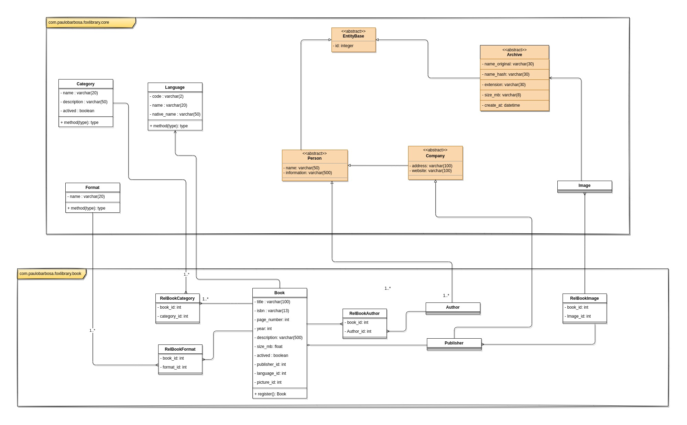

# Fox Library 🦊

Welcome to this project, here you will see a little about a digital library.

## Table of contents
* [Class Diagram](#class-diagram)

## Some ideas 💡

### 📚 Books
Here is some ideas for the books.

### Actions
- Register;
- Update;
- Delete - logic;

**Search:**

- By title;
- By isbn;
- By author;
- By categories;
- By pages number;
- By publisher;
___

## Class Diagram

