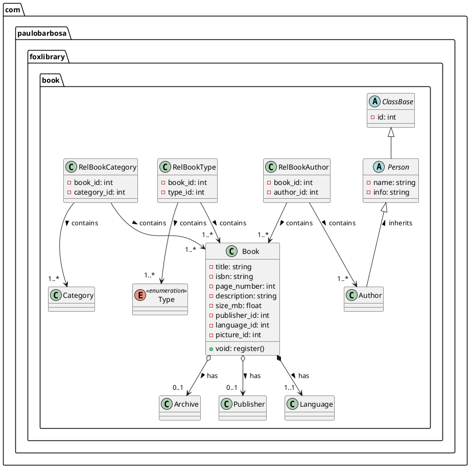

# 🦊 Fox Library 🦊

This is a really cool project for a digital library! 

## Table of contents

* [Some ideas](#some-ideas-)
    * [Books](#-books)
    * [Audios](#-audios)
    * [Videos](#-videos)
    * [Photos](#-photos)
* [Class Diagram](#class-diagram)

## Some ideas 💡

### 📚 Books
Here is some ideas for the books.

### Attributes

| BOOK        |
|-------------|
| TYPE        |
| ISBN        |
| TITTLE      |
| AUTHOR      |
| PAGE_NUMBER |
| SIZE_MB     |
| YEAR        |
| PUBLISHER   |
| CATEGORY    |
| LANGUAGE    |
| DESCRIPTION |
| PICTURE     |

### Actions
- Register;
- Update;
- Delete - logic;

**Search:**

- By title;
- By isbn;
- By author;
- By categories;
- By pages number;
- By publisher;
___

### 🎧 Audios

- Register;
- Update;
- Delete - logic;

**Search:**

- By title;
- By singer;
- By genres;
- By album;
- By minutes interval;
- By record company;
___

### 🎞️ Videos

### 📷 Photos

## Class Diagram

