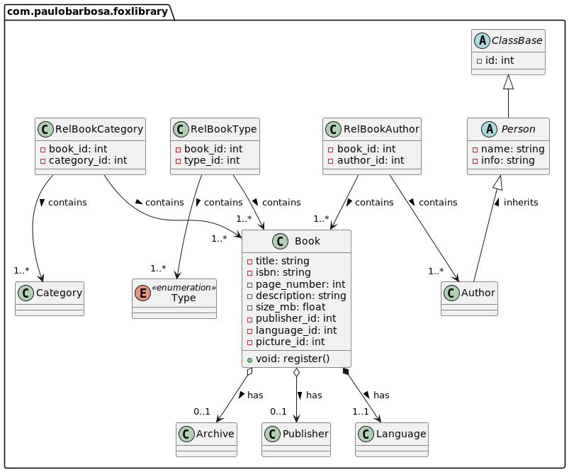
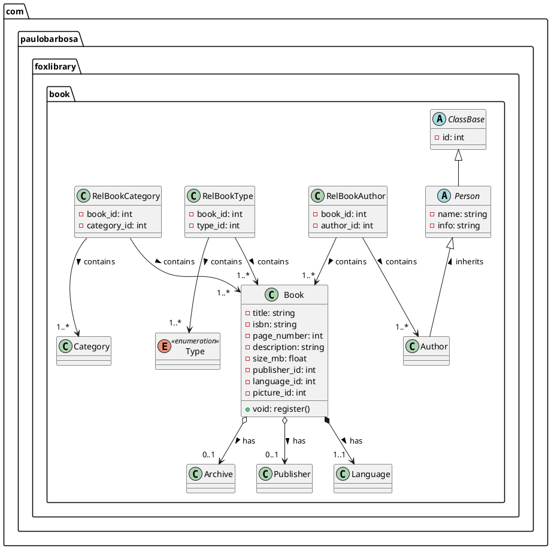

# 🦊 Fox Library 🦊

This is a really cool project for a digital library! 

## Table of contents


* [Some ideas](#some-ideas-)
    * [Books](#-books)
    * [Audios](#-audios)
    * [Videos](#-videos)
    * [Photos](#-photos)
* [Class Diagram](#class-diagram)

## Some ideas 💡

### 📚 Books
Here is some ideas for the books.

### Attributes

| BOOK        |
|-------------|
| TYPE        |
| ISBN        |
| TITTLE      |
| AUTHOR      |
| PAGE_NUMBER |
| SIZE_MB     |
| YEAR        |
| PUBLISHER   |
| CATEGORY    |
| LANGUAGE    |
| DESCRIPTION |
| PICTURE     |


### Actions
- Register;
- Update;
- Delete - logic;

**Search:**

- By title;
- By isbn;
- By author;
- By categories;
- By pages number;
- By publisher;
___

### 🎧 Audios

- Register;
- Update;
- Delete - logic;

**Search:**

- By title;
- By singer;
- By genres;
- By album;
- By minutes interval;
- By record company;
___


### 🎞️ Videos

### 📷 Photos

## Class Diagram





### Idiom

```json

[
  {
    "code": "aa",
    "name": "Afar",
    "native": "Afar"
  },
  {
    "code": "ab",
    "name": "Abkhazian",
    "native": "Аҧсуа"
  },
  {
    "code": "af",
    "name": "Afrikaans",
    "native": "Afrikaans"
  },
  {
    "code": "ak",
    "name": "Akan",
    "native": "Akana"
  },
  {
    "code": "am",
    "name": "Amharic",
    "native": "አማርኛ"
  },
  {
    "code": "an",
    "name": "Aragonese",
    "native": "Aragonés"
  },
  {
    "code": "ar",
    "name": "Arabic",
    "native": "العربية"
  },
  {
    "code": "as",
    "name": "Assamese",
    "native": "অসমীয়া"
  },
  {
    "code": "av",
    "name": "Avar",
    "native": "Авар"
  },
  {
    "code": "ay",
    "name": "Aymara",
    "native": "Aymar"
  },
  {
    "code": "az",
    "name": "Azerbaijani",
    "native": "Azərbaycanca / آذربايجان"
  },
  {
    "code": "ba",
    "name": "Bashkir",
    "native": "Башҡорт"
  },
  {
    "code": "be",
    "name": "Belarusian",
    "native": "Беларуская"
  },
  {
    "code": "bg",
    "name": "Bulgarian",
    "native": "Български"
  },
  {
    "code": "bh",
    "name": "Bihari",
    "native": "भोजपुरी"
  },
  {
    "code": "bi",
    "name": "Bislama",
    "native": "Bislama"
  },
  {
    "code": "bm",
    "name": "Bambara",
    "native": "Bamanankan"
  },
  {
    "code": "bn",
    "name": "Bengali",
    "native": "বাংলা"
  },
  {
    "code": "bo",
    "name": "Tibetan",
    "native": "བོད་ཡིག / Bod skad"
  },
  {
    "code": "br",
    "name": "Breton",
    "native": "Brezhoneg"
  },
  {
    "code": "bs",
    "name": "Bosnian",
    "native": "Bosanski"
  },
  {
    "code": "ca",
    "name": "Catalan",
    "native": "Català"
  },
  {
    "code": "ce",
    "name": "Chechen",
    "native": "Нохчийн"
  },
  {
    "code": "ch",
    "name": "Chamorro",
    "native": "Chamoru"
  },
  {
    "code": "co",
    "name": "Corsican",
    "native": "Corsu"
  },
  {
    "code": "cr",
    "name": "Cree",
    "native": "Nehiyaw"
  },
  {
    "code": "cs",
    "name": "Czech",
    "native": "Česky"
  },
  {
    "code": "cu",
    "name": "Old Church Slavonic / Old Bulgarian",
    "native": "словѣньскъ / slověnĭskŭ"
  },
  {
    "code": "cv",
    "name": "Chuvash",
    "native": "Чăваш"
  },
  {
    "code": "cy",
    "name": "Welsh",
    "native": "Cymraeg"
  },
  {
    "code": "da",
    "name": "Danish",
    "native": "Dansk"
  },
  {
    "code": "de",
    "name": "German",
    "native": "Deutsch"
  },
  {
    "code": "dv",
    "name": "Divehi",
    "native": "ދިވެހިބަސް"
  },
  {
    "code": "dz",
    "name": "Dzongkha",
    "native": "ཇོང་ཁ"
  },
  {
    "code": "ee",
    "name": "Ewe",
    "native": "Ɛʋɛ"
  },
  {
    "code": "el",
    "name": "Greek",
    "native": "Ελληνικά"
  },
  {
    "code": "en",
    "name": "English",
    "native": "English"
  },
  {
    "code": "eo",
    "name": "Esperanto",
    "native": "Esperanto"
  },
  {
    "code": "es",
    "name": "Spanish",
    "native": "Español"
  },
  {
    "code": "et",
    "name": "Estonian",
    "native": "Eesti"
  },
  {
    "code": "eu",
    "name": "Basque",
    "native": "Euskara"
  },
  {
    "code": "fa",
    "name": "Persian",
    "native": "فارسی"
  },
  {
    "code": "ff",
    "name": "Peul",
    "native": "Fulfulde"
  },
  {
    "code": "fi",
    "name": "Finnish",
    "native": "Suomi"
  },
  {
    "code": "fj",
    "name": "Fijian",
    "native": "Na Vosa Vakaviti"
  },
  {
    "code": "fo",
    "name": "Faroese",
    "native": "Føroyskt"
  },
  {
    "code": "fr",
    "name": "French",
    "native": "Français"
  },
  {
    "code": "fy",
    "name": "West Frisian",
    "native": "Frysk"
  },
  {
    "code": "ga",
    "name": "Irish",
    "native": "Gaeilge"
  },
  {
    "code": "gd",
    "name": "Scottish Gaelic",
    "native": "Gàidhlig"
  },
  {
    "code": "gl",
    "name": "Galician",
    "native": "Galego"
  },
  {
    "code": "gn",
    "name": "Guarani",
    "native": "Avañe'ẽ"
  },
  {
    "code": "gu",
    "name": "Gujarati",
    "native": "ગુજરાતી"
  },
  {
    "code": "gv",
    "name": "Manx",
    "native": "Gaelg"
  },
  {
    "code": "ha",
    "name": "Hausa",
    "native": "هَوُسَ"
  },
  {
    "code": "he",
    "name": "Hebrew",
    "native": "עברית"
  },
  {
    "code": "hi",
    "name": "Hindi",
    "native": "हिन्दी"
  },
  {
    "code": "ho",
    "name": "Hiri Motu",
    "native": "Hiri Motu"
  },
  {
    "code": "hr",
    "name": "Croatian",
    "native": "Hrvatski"
  },
  {
    "code": "ht",
    "name": "Haitian",
    "native": "Krèyol ayisyen"
  },
  {
    "code": "hu",
    "name": "Hungarian",
    "native": "Magyar"
  },
  {
    "code": "hy",
    "name": "Armenian",
    "native": "Հայերեն"
  },
  {
    "code": "hz",
    "name": "Herero",
    "native": "Otsiherero"
  },
  {
    "code": "ia",
    "name": "Interlingua",
    "native": "Interlingua"
  },
  {
    "code": "id",
    "name": "Indonesian",
    "native": "Bahasa Indonesia"
  },
  {
    "code": "ie",
    "name": "Interlingue",
    "native": "Interlingue"
  },
  {
    "code": "ig",
    "name": "Igbo",
    "native": "Igbo"
  },
  {
    "code": "ii",
    "name": "Sichuan Yi",
    "native": "ꆇꉙ / 四川彝语"
  },
  {
    "code": "ik",
    "name": "Inupiak",
    "native": "Iñupiak"
  },
  {
    "code": "io",
    "name": "Ido",
    "native": "Ido"
  },
  {
    "code": "is",
    "name": "Icelandic",
    "native": "Íslenska"
  },
  {
    "code": "it",
    "name": "Italian",
    "native": "Italiano"
  },
  {
    "code": "iu",
    "name": "Inuktitut",
    "native": "ᐃᓄᒃᑎᑐᑦ"
  },
  {
    "code": "ja",
    "name": "Japanese",
    "native": "日本語"
  },
  {
    "code": "jv",
    "name": "Javanese",
    "native": "Basa Jawa"
  },
  {
    "code": "ka",
    "name": "Georgian",
    "native": "ქართული"
  },
  {
    "code": "kg",
    "name": "Kongo",
    "native": "KiKongo"
  },
  {
    "code": "ki",
    "name": "Kikuyu",
    "native": "Gĩkũyũ"
  },
  {
    "code": "kj",
    "name": "Kuanyama",
    "native": "Kuanyama"
  },
  {
    "code": "kk",
    "name": "Kazakh",
    "native": "Қазақша"
  },
  {
    "code": "kl",
    "name": "Greenlandic",
    "native": "Kalaallisut"
  },
  {
    "code": "km",
    "name": "Cambodian",
    "native": "ភាសាខ្មែរ"
  },
  {
    "code": "kn",
    "name": "Kannada",
    "native": "ಕನ್ನಡ"
  },
  {
    "code": "ko",
    "name": "Korean",
    "native": "한국어"
  },
  {
    "code": "kr",
    "name": "Kanuri",
    "native": "Kanuri"
  },
  {
    "code": "ks",
    "name": "Kashmiri",
    "native": "कश्मीरी / كشميري"
  },
  {
    "code": "ku",
    "name": "Kurdish",
    "native": "Kurdî / كوردی"
  },
  {
    "code": "kv",
    "name": "Komi",
    "native": "Коми"
  },
  {
    "code": "kw",
    "name": "Cornish",
    "native": "Kernewek"
  },
  {
    "code": "ky",
    "name": "Kirghiz",
    "native": "Kırgızca / Кыргызча"
  },
  {
    "code": "la",
    "name": "Latin",
    "native": "Latina"
  },
  {
    "code": "lb",
    "name": "Luxembourgish",
    "native": "Lëtzebuergesch"
  },
  {
    "code": "lg",
    "name": "Ganda",
    "native": "Luganda"
  },
  {
    "code": "li",
    "name": "Limburgian",
    "native": "Limburgs"
  },
  {
    "code": "ln",
    "name": "Lingala",
    "native": "Lingála"
  },
  {
    "code": "lo",
    "name": "Laotian",
    "native": "ລາວ / Pha xa lao"
  },
  {
    "code": "lt",
    "name": "Lithuanian",
    "native": "Lietuvių"
  },
  {
    "code": "lu",
    "name": "Luba-Katanga",
    "native": "Tshiluba"
  },
  {
    "code": "lv",
    "name": "Latvian",
    "native": "Latviešu"
  },
  {
    "code": "mg",
    "name": "Malagasy",
    "native": "Malagasy"
  },
  {
    "code": "mh",
    "name": "Marshallese",
    "native": "Kajin Majel / Ebon"
  },
  {
    "code": "mi",
    "name": "Maori",
    "native": "Māori"
  },
  {
    "code": "mk",
    "name": "Macedonian",
    "native": "Македонски"
  },
  {
    "code": "ml",
    "name": "Malayalam",
    "native": "മലയാളം"
  },
  {
    "code": "mn",
    "name": "Mongolian",
    "native": "Монгол"
  },
  {
    "code": "mo",
    "name": "Moldovan",
    "native": "Moldovenească"
  },
  {
    "code": "mr",
    "name": "Marathi",
    "native": "मराठी"
  },
  {
    "code": "ms",
    "name": "Malay",
    "native": "Bahasa Melayu"
  },
  {
    "code": "mt",
    "name": "Maltese",
    "native": "bil-Malti"
  },
  {
    "code": "my",
    "name": "Burmese",
    "native": "မြန်မာစာ"
  },
  {
    "code": "na",
    "name": "Nauruan",
    "native": "Dorerin Naoero"
  },
  {
    "code": "nb",
    "name": "Norwegian Bokmål",
    "native": "Norsk bokmål"
  },
  {
    "code": "nd",
    "name": "North Ndebele",
    "native": "Sindebele"
  },
  {
    "code": "ne",
    "name": "Nepali",
    "native": "नेपाली"
  },
  {
    "code": "ng",
    "name": "Ndonga",
    "native": "Oshiwambo"
  },
  {
    "code": "nl",
    "name": "Dutch",
    "native": "Nederlands"
  },
  {
    "code": "nn",
    "name": "Norwegian Nynorsk",
    "native": "Norsk nynorsk"
  },
  {
    "code": "no",
    "name": "Norwegian",
    "native": "Norsk"
  },
  {
    "code": "nr",
    "name": "South Ndebele",
    "native": "isiNdebele"
  },
  {
    "code": "nv",
    "name": "Navajo",
    "native": "Diné bizaad"
  },
  {
    "code": "ny",
    "name": "Chichewa",
    "native": "Chi-Chewa"
  },
  {
    "code": "oc",
    "name": "Occitan",
    "native": "Occitan"
  },
  {
    "code": "oj",
    "name": "Ojibwa",
    "native": "ᐊᓂᔑᓈᐯᒧᐎᓐ / Anishinaabemowin"
  },
  {
    "code": "om",
    "name": "Oromo",
    "native": "Oromoo"
  },
  {
    "code": "or",
    "name": "Oriya",
    "native": "ଓଡ଼ିଆ"
  },
  {
    "code": "os",
    "name": "Ossetian / Ossetic",
    "native": "Иронау"
  },
  {
    "code": "pa",
    "name": "Panjabi / Punjabi",
    "native": "ਪੰਜਾਬੀ / पंजाबी / پنجابي"
  },
  {
    "code": "pi",
    "name": "Pali",
    "native": "Pāli / पाऴि"
  },
  {
    "code": "pl",
    "name": "Polish",
    "native": "Polski"
  },
  {
    "code": "ps",
    "name": "Pashto",
    "native": "پښتو"
  },
  {
    "code": "pt",
    "name": "Portuguese",
    "native": "Português"
  },
  {
    "code": "qu",
    "name": "Quechua",
    "native": "Runa Simi"
  },
  {
    "code": "rm",
    "name": "Raeto Romance",
    "native": "Rumantsch"
  },
  {
    "code": "rn",
    "name": "Kirundi",
    "native": "Kirundi"
  },
  {
    "code": "ro",
    "name": "Romanian",
    "native": "Română"
  },
  {
    "code": "ru",
    "name": "Russian",
    "native": "Русский"
  },
  {
    "code": "rw",
    "name": "Rwandi",
    "native": "Kinyarwandi"
  },
  {
    "code": "sa",
    "name": "Sanskrit",
    "native": "संस्कृतम्"
  },
  {
    "code": "sc",
    "name": "Sardinian",
    "native": "Sardu"
  },
  {
    "code": "sd",
    "name": "Sindhi",
    "native": "सिनधि"
  },
  {
    "code": "se",
    "name": "Northern Sami",
    "native": "Sámegiella"
  },
  {
    "code": "sg",
    "name": "Sango",
    "native": "Sängö"
  },
  {
    "code": "sh",
    "name": "Serbo-Croatian",
    "native": "Srpskohrvatski / Српскохрватски"
  },
  {
    "code": "si",
    "name": "Sinhalese",
    "native": "සිංහල"
  },
  {
    "code": "sk",
    "name": "Slovak",
    "native": "Slovenčina"
  },
  {
    "code": "sl",
    "name": "Slovenian",
    "native": "Slovenščina"
  },
  {
    "code": "sm",
    "name": "Samoan",
    "native": "Gagana Samoa"
  },
  {
    "code": "sn",
    "name": "Shona",
    "native": "chiShona"
  },
  {
    "code": "so",
    "name": "Somalia",
    "native": "Soomaaliga"
  },
  {
    "code": "sq",
    "name": "Albanian",
    "native": "Shqip"
  },
  {
    "code": "sr",
    "name": "Serbian",
    "native": "Српски"
  },
  {
    "code": "ss",
    "name": "Swati",
    "native": "SiSwati"
  },
  {
    "code": "st",
    "name": "Southern Sotho",
    "native": "Sesotho"
  },
  {
    "code": "su",
    "name": "Sundanese",
    "native": "Basa Sunda"
  },
  {
    "code": "sv",
    "name": "Swedish",
    "native": "Svenska"
  },
  {
    "code": "sw",
    "name": "Swahili",
    "native": "Kiswahili"
  },
  {
    "code": "ta",
    "name": "Tamil",
    "native": "தமிழ்"
  },
  {
    "code": "te",
    "name": "Telugu",
    "native": "తెలుగు"
  },
  {
    "code": "tg",
    "name": "Tajik",
    "native": "Тоҷикӣ"
  },
  {
    "code": "th",
    "name": "Thai",
    "native": "ไทย / Phasa Thai"
  },
  {
    "code": "ti",
    "name": "Tigrinya",
    "native": "ትግርኛ"
  },
  {
    "code": "tk",
    "name": "Turkmen",
    "native": "Туркмен / تركمن"
  },
  {
    "code": "tl",
    "name": "Tagalog / Filipino",
    "native": "Tagalog"
  },
  {
    "code": "tn",
    "name": "Tswana",
    "native": "Setswana"
  },
  {
    "code": "to",
    "name": "Tonga",
    "native": "Lea Faka-Tonga"
  },
  {
    "code": "tr",
    "name": "Turkish",
    "native": "Türkçe"
  },
  {
    "code": "ts",
    "name": "Tsonga",
    "native": "Xitsonga"
  },
  {
    "code": "tt",
    "name": "Tatar",
    "native": "Tatarça"
  },
  {
    "code": "tw",
    "name": "Twi",
    "native": "Twi"
  },
  {
    "code": "ty",
    "name": "Tahitian",
    "native": "Reo Mā`ohi"
  },
  {
    "code": "ug",
    "name": "Uyghur",
    "native": "Uyƣurqə / ئۇيغۇرچە"
  },
  {
    "code": "uk",
    "name": "Ukrainian",
    "native": "Українська"
  },
  {
    "code": "ur",
    "name": "Urdu",
    "native": "اردو"
  },
  {
    "code": "uz",
    "name": "Uzbek",
    "native": "Ўзбек"
  },
  {
    "code": "ve",
    "name": "Venda",
    "native": "Tshivenḓa"
  },
  {
    "code": "vi",
    "name": "Vietnamese",
    "native": "Tiếng Việt"
  },
  {
    "code": "vo",
    "name": "Volapük",
    "native": "Volapük"
  },
  {
    "code": "wa",
    "name": "Walloon",
    "native": "Walon"
  },
  {
    "code": "wo",
    "name": "Wolof",
    "native": "Wollof"
  },
  {
    "code": "xh",
    "name": "Xhosa",
    "native": "isiXhosa"
  },
  {
    "code": "yi",
    "name": "Yiddish",
    "native": "ייִדיש"
  },
  {
    "code": "yo",
    "name": "Yoruba",
    "native": "Yorùbá"
  },
  {
    "code": "za",
    "name": "Zhuang",
    "native": "Cuengh / Tôô / 壮语"
  },
  {
    "code": "zh",
    "name": "Chinese",
    "native": "中文"
  },
  {
    "code": "zu",
    "name": "Zulu",
    "native": "isiZulu"
  }
]
```

**.sql**

```sql
CREATE TABLE idiom(
   code   VARCHAR(2) NOT NULL PRIMARY KEY
  ,name   VARCHAR(35) NOT NULL
  ,native VARCHAR(31) NOT NULL
);
INSERT INTO idiom(code,name,native) VALUES ('aa','Afar','Afar');
INSERT INTO idiom(code,name,native) VALUES ('ab','Abkhazian','Аҧсуа');
INSERT INTO idiom(code,name,native) VALUES ('af','Afrikaans','Afrikaans');
INSERT INTO idiom(code,name,native) VALUES ('ak','Akan','Akana');
INSERT INTO idiom(code,name,native) VALUES ('am','Amharic','አማርኛ');
INSERT INTO idiom(code,name,native) VALUES ('an','Aragonese','Aragonés');
INSERT INTO idiom(code,name,native) VALUES ('ar','Arabic','العربية');
INSERT INTO idiom(code,name,native) VALUES ('as','Assamese','অসমীয়া');
INSERT INTO idiom(code,name,native) VALUES ('av','Avar','Авар');
INSERT INTO idiom(code,name,native) VALUES ('ay','Aymara','Aymar');
INSERT INTO idiom(code,name,native) VALUES ('az','Azerbaijani','Azərbaycanca / آذربايجان');
INSERT INTO idiom(code,name,native) VALUES ('ba','Bashkir','Башҡорт');
INSERT INTO idiom(code,name,native) VALUES ('be','Belarusian','Беларуская');
INSERT INTO idiom(code,name,native) VALUES ('bg','Bulgarian','Български');
INSERT INTO idiom(code,name,native) VALUES ('bh','Bihari','भोजपुरी');
INSERT INTO idiom(code,name,native) VALUES ('bi','Bislama','Bislama');
INSERT INTO idiom(code,name,native) VALUES ('bm','Bambara','Bamanankan');
INSERT INTO idiom(code,name,native) VALUES ('bn','Bengali','বাংলা');
INSERT INTO idiom(code,name,native) VALUES ('bo','Tibetan','བོད་ཡིག / Bod skad');
INSERT INTO idiom(code,name,native) VALUES ('br','Breton','Brezhoneg');
INSERT INTO idiom(code,name,native) VALUES ('bs','Bosnian','Bosanski');
INSERT INTO idiom(code,name,native) VALUES ('ca','Catalan','Català');
INSERT INTO idiom(code,name,native) VALUES ('ce','Chechen','Нохчийн');
INSERT INTO idiom(code,name,native) VALUES ('ch','Chamorro','Chamoru');
INSERT INTO idiom(code,name,native) VALUES ('co','Corsican','Corsu');
INSERT INTO idiom(code,name,native) VALUES ('cr','Cree','Nehiyaw');
INSERT INTO idiom(code,name,native) VALUES ('cs','Czech','Česky');
INSERT INTO idiom(code,name,native) VALUES ('cu','Old Church Slavonic / Old Bulgarian','словѣньскъ / slověnĭskŭ');
INSERT INTO idiom(code,name,native) VALUES ('cv','Chuvash','Чăваш');
INSERT INTO idiom(code,name,native) VALUES ('cy','Welsh','Cymraeg');
INSERT INTO idiom(code,name,native) VALUES ('da','Danish','Dansk');
INSERT INTO idiom(code,name,native) VALUES ('de','German','Deutsch');
INSERT INTO idiom(code,name,native) VALUES ('dv','Divehi','ދިވެހިބަސް');
INSERT INTO idiom(code,name,native) VALUES ('dz','Dzongkha','ཇོང་ཁ');
INSERT INTO idiom(code,name,native) VALUES ('ee','Ewe','Ɛʋɛ');
INSERT INTO idiom(code,name,native) VALUES ('el','Greek','Ελληνικά');
INSERT INTO idiom(code,name,native) VALUES ('en','English','English');
INSERT INTO idiom(code,name,native) VALUES ('eo','Esperanto','Esperanto');
INSERT INTO idiom(code,name,native) VALUES ('es','Spanish','Español');
INSERT INTO idiom(code,name,native) VALUES ('et','Estonian','Eesti');
INSERT INTO idiom(code,name,native) VALUES ('eu','Basque','Euskara');
INSERT INTO idiom(code,name,native) VALUES ('fa','Persian','فارسی');
INSERT INTO idiom(code,name,native) VALUES ('ff','Peul','Fulfulde');
INSERT INTO idiom(code,name,native) VALUES ('fi','Finnish','Suomi');
INSERT INTO idiom(code,name,native) VALUES ('fj','Fijian','Na Vosa Vakaviti');
INSERT INTO idiom(code,name,native) VALUES ('fo','Faroese','Føroyskt');
INSERT INTO idiom(code,name,native) VALUES ('fr','French','Français');
INSERT INTO idiom(code,name,native) VALUES ('fy','West Frisian','Frysk');
INSERT INTO idiom(code,name,native) VALUES ('ga','Irish','Gaeilge');
INSERT INTO idiom(code,name,native) VALUES ('gd','Scottish Gaelic','Gàidhlig');
INSERT INTO idiom(code,name,native) VALUES ('gl','Galician','Galego');
INSERT INTO idiom(code,name,native) VALUES ('gn','Guarani','Avañe''ẽ');
INSERT INTO idiom(code,name,native) VALUES ('gu','Gujarati','ગુજરાતી');
INSERT INTO idiom(code,name,native) VALUES ('gv','Manx','Gaelg');
INSERT INTO idiom(code,name,native) VALUES ('ha','Hausa','هَوُسَ');
INSERT INTO idiom(code,name,native) VALUES ('he','Hebrew','עברית');
INSERT INTO idiom(code,name,native) VALUES ('hi','Hindi','हिन्दी');
INSERT INTO idiom(code,name,native) VALUES ('ho','Hiri Motu','Hiri Motu');
INSERT INTO idiom(code,name,native) VALUES ('hr','Croatian','Hrvatski');
INSERT INTO idiom(code,name,native) VALUES ('ht','Haitian','Krèyol ayisyen');
INSERT INTO idiom(code,name,native) VALUES ('hu','Hungarian','Magyar');
INSERT INTO idiom(code,name,native) VALUES ('hy','Armenian','Հայերեն');
INSERT INTO idiom(code,name,native) VALUES ('hz','Herero','Otsiherero');
INSERT INTO idiom(code,name,native) VALUES ('ia','Interlingua','Interlingua');
INSERT INTO idiom(code,name,native) VALUES ('id','Indonesian','Bahasa Indonesia');
INSERT INTO idiom(code,name,native) VALUES ('ie','Interlingue','Interlingue');
INSERT INTO idiom(code,name,native) VALUES ('ig','Igbo','Igbo');
INSERT INTO idiom(code,name,native) VALUES ('ii','Sichuan Yi','ꆇꉙ / 四川彝语');
INSERT INTO idiom(code,name,native) VALUES ('ik','Inupiak','Iñupiak');
INSERT INTO idiom(code,name,native) VALUES ('io','Ido','Ido');
INSERT INTO idiom(code,name,native) VALUES ('is','Icelandic','Íslenska');
INSERT INTO idiom(code,name,native) VALUES ('it','Italian','Italiano');
INSERT INTO idiom(code,name,native) VALUES ('iu','Inuktitut','ᐃᓄᒃᑎᑐᑦ');
INSERT INTO idiom(code,name,native) VALUES ('ja','Japanese','日本語');
INSERT INTO idiom(code,name,native) VALUES ('jv','Javanese','Basa Jawa');
INSERT INTO idiom(code,name,native) VALUES ('ka','Georgian','ქართული');
INSERT INTO idiom(code,name,native) VALUES ('kg','Kongo','KiKongo');
INSERT INTO idiom(code,name,native) VALUES ('ki','Kikuyu','Gĩkũyũ');
INSERT INTO idiom(code,name,native) VALUES ('kj','Kuanyama','Kuanyama');
INSERT INTO idiom(code,name,native) VALUES ('kk','Kazakh','Қазақша');
INSERT INTO idiom(code,name,native) VALUES ('kl','Greenlandic','Kalaallisut');
INSERT INTO idiom(code,name,native) VALUES ('km','Cambodian','ភាសាខ្មែរ');
INSERT INTO idiom(code,name,native) VALUES ('kn','Kannada','ಕನ್ನಡ');
INSERT INTO idiom(code,name,native) VALUES ('ko','Korean','한국어');
INSERT INTO idiom(code,name,native) VALUES ('kr','Kanuri','Kanuri');
INSERT INTO idiom(code,name,native) VALUES ('ks','Kashmiri','कश्मीरी / كشميري');
INSERT INTO idiom(code,name,native) VALUES ('ku','Kurdish','Kurdî / كوردی');
INSERT INTO idiom(code,name,native) VALUES ('kv','Komi','Коми');
INSERT INTO idiom(code,name,native) VALUES ('kw','Cornish','Kernewek');
INSERT INTO idiom(code,name,native) VALUES ('ky','Kirghiz','Kırgızca / Кыргызча');
INSERT INTO idiom(code,name,native) VALUES ('la','Latin','Latina');
INSERT INTO idiom(code,name,native) VALUES ('lb','Luxembourgish','Lëtzebuergesch');
INSERT INTO idiom(code,name,native) VALUES ('lg','Ganda','Luganda');
INSERT INTO idiom(code,name,native) VALUES ('li','Limburgian','Limburgs');
INSERT INTO idiom(code,name,native) VALUES ('ln','Lingala','Lingála');
INSERT INTO idiom(code,name,native) VALUES ('lo','Laotian','ລາວ / Pha xa lao');
INSERT INTO idiom(code,name,native) VALUES ('lt','Lithuanian','Lietuvių');
INSERT INTO idiom(code,name,native) VALUES ('lu','Luba-Katanga','Tshiluba');
INSERT INTO idiom(code,name,native) VALUES ('lv','Latvian','Latviešu');
INSERT INTO idiom(code,name,native) VALUES ('mg','Malagasy','Malagasy');
INSERT INTO idiom(code,name,native) VALUES ('mh','Marshallese','Kajin Majel / Ebon');
INSERT INTO idiom(code,name,native) VALUES ('mi','Maori','Māori');
INSERT INTO idiom(code,name,native) VALUES ('mk','Macedonian','Македонски');
INSERT INTO idiom(code,name,native) VALUES ('ml','Malayalam','മലയാളം');
INSERT INTO idiom(code,name,native) VALUES ('mn','Mongolian','Монгол');
INSERT INTO idiom(code,name,native) VALUES ('mo','Moldovan','Moldovenească');
INSERT INTO idiom(code,name,native) VALUES ('mr','Marathi','मराठी');
INSERT INTO idiom(code,name,native) VALUES ('ms','Malay','Bahasa Melayu');
INSERT INTO idiom(code,name,native) VALUES ('mt','Maltese','bil-Malti');
INSERT INTO idiom(code,name,native) VALUES ('my','Burmese','မြန်မာစာ');
INSERT INTO idiom(code,name,native) VALUES ('na','Nauruan','Dorerin Naoero');
INSERT INTO idiom(code,name,native) VALUES ('nb','Norwegian Bokmål','Norsk bokmål');
INSERT INTO idiom(code,name,native) VALUES ('nd','North Ndebele','Sindebele');
INSERT INTO idiom(code,name,native) VALUES ('ne','Nepali','नेपाली');
INSERT INTO idiom(code,name,native) VALUES ('ng','Ndonga','Oshiwambo');
INSERT INTO idiom(code,name,native) VALUES ('nl','Dutch','Nederlands');
INSERT INTO idiom(code,name,native) VALUES ('nn','Norwegian Nynorsk','Norsk nynorsk');
INSERT INTO idiom(code,name,native) VALUES ('no','Norwegian','Norsk');
INSERT INTO idiom(code,name,native) VALUES ('nr','South Ndebele','isiNdebele');
INSERT INTO idiom(code,name,native) VALUES ('nv','Navajo','Diné bizaad');
INSERT INTO idiom(code,name,native) VALUES ('ny','Chichewa','Chi-Chewa');
INSERT INTO idiom(code,name,native) VALUES ('oc','Occitan','Occitan');
INSERT INTO idiom(code,name,native) VALUES ('oj','Ojibwa','ᐊᓂᔑᓈᐯᒧᐎᓐ / Anishinaabemowin');
INSERT INTO idiom(code,name,native) VALUES ('om','Oromo','Oromoo');
INSERT INTO idiom(code,name,native) VALUES ('or','Oriya','ଓଡ଼ିଆ');
INSERT INTO idiom(code,name,native) VALUES ('os','Ossetian / Ossetic','Иронау');
INSERT INTO idiom(code,name,native) VALUES ('pa','Panjabi / Punjabi','ਪੰਜਾਬੀ / पंजाबी / پنجابي');
INSERT INTO idiom(code,name,native) VALUES ('pi','Pali','Pāli / पाऴि');
INSERT INTO idiom(code,name,native) VALUES ('pl','Polish','Polski');
INSERT INTO idiom(code,name,native) VALUES ('ps','Pashto','پښتو');
INSERT INTO idiom(code,name,native) VALUES ('pt','Portuguese','Português');
INSERT INTO idiom(code,name,native) VALUES ('qu','Quechua','Runa Simi');
INSERT INTO idiom(code,name,native) VALUES ('rm','Raeto Romance','Rumantsch');
INSERT INTO idiom(code,name,native) VALUES ('rn','Kirundi','Kirundi');
INSERT INTO idiom(code,name,native) VALUES ('ro','Romanian','Română');
INSERT INTO idiom(code,name,native) VALUES ('ru','Russian','Русский');
INSERT INTO idiom(code,name,native) VALUES ('rw','Rwandi','Kinyarwandi');
INSERT INTO idiom(code,name,native) VALUES ('sa','Sanskrit','संस्कृतम्');
INSERT INTO idiom(code,name,native) VALUES ('sc','Sardinian','Sardu');
INSERT INTO idiom(code,name,native) VALUES ('sd','Sindhi','सिनधि');
INSERT INTO idiom(code,name,native) VALUES ('se','Northern Sami','Sámegiella');
INSERT INTO idiom(code,name,native) VALUES ('sg','Sango','Sängö');
INSERT INTO idiom(code,name,native) VALUES ('sh','Serbo-Croatian','Srpskohrvatski / Српскохрватски');
INSERT INTO idiom(code,name,native) VALUES ('si','Sinhalese','සිංහල');
INSERT INTO idiom(code,name,native) VALUES ('sk','Slovak','Slovenčina');
INSERT INTO idiom(code,name,native) VALUES ('sl','Slovenian','Slovenščina');
INSERT INTO idiom(code,name,native) VALUES ('sm','Samoan','Gagana Samoa');
INSERT INTO idiom(code,name,native) VALUES ('sn','Shona','chiShona');
INSERT INTO idiom(code,name,native) VALUES ('so','Somalia','Soomaaliga');
INSERT INTO idiom(code,name,native) VALUES ('sq','Albanian','Shqip');
INSERT INTO idiom(code,name,native) VALUES ('sr','Serbian','Српски');
INSERT INTO idiom(code,name,native) VALUES ('ss','Swati','SiSwati');
INSERT INTO idiom(code,name,native) VALUES ('st','Southern Sotho','Sesotho');
INSERT INTO idiom(code,name,native) VALUES ('su','Sundanese','Basa Sunda');
INSERT INTO idiom(code,name,native) VALUES ('sv','Swedish','Svenska');
INSERT INTO idiom(code,name,native) VALUES ('sw','Swahili','Kiswahili');
INSERT INTO idiom(code,name,native) VALUES ('ta','Tamil','தமிழ்');
INSERT INTO idiom(code,name,native) VALUES ('te','Telugu','తెలుగు');
INSERT INTO idiom(code,name,native) VALUES ('tg','Tajik','Тоҷикӣ');
INSERT INTO idiom(code,name,native) VALUES ('th','Thai','ไทย / Phasa Thai');
INSERT INTO idiom(code,name,native) VALUES ('ti','Tigrinya','ትግርኛ');
INSERT INTO idiom(code,name,native) VALUES ('tk','Turkmen','Туркмен / تركمن');
INSERT INTO idiom(code,name,native) VALUES ('tl','Tagalog / Filipino','Tagalog');
INSERT INTO idiom(code,name,native) VALUES ('tn','Tswana','Setswana');
INSERT INTO idiom(code,name,native) VALUES ('to','Tonga','Lea Faka-Tonga');
INSERT INTO idiom(code,name,native) VALUES ('tr','Turkish','Türkçe');
INSERT INTO idiom(code,name,native) VALUES ('ts','Tsonga','Xitsonga');
INSERT INTO idiom(code,name,native) VALUES ('tt','Tatar','Tatarça');
INSERT INTO idiom(code,name,native) VALUES ('tw','Twi','Twi');
INSERT INTO idiom(code,name,native) VALUES ('ty','Tahitian','Reo Mā`ohi');
INSERT INTO idiom(code,name,native) VALUES ('ug','Uyghur','Uyƣurqə / ئۇيغۇرچە');
INSERT INTO idiom(code,name,native) VALUES ('uk','Ukrainian','Українська');
INSERT INTO idiom(code,name,native) VALUES ('ur','Urdu','اردو');
INSERT INTO idiom(code,name,native) VALUES ('uz','Uzbek','Ўзбек');
INSERT INTO idiom(code,name,native) VALUES ('ve','Venda','Tshivenḓa');
INSERT INTO idiom(code,name,native) VALUES ('vi','Vietnamese','Tiếng Việt');
INSERT INTO idiom(code,name,native) VALUES ('vo','Volapük','Volapük');
INSERT INTO idiom(code,name,native) VALUES ('wa','Walloon','Walon');
INSERT INTO idiom(code,name,native) VALUES ('wo','Wolof','Wollof');
INSERT INTO idiom(code,name,native) VALUES ('xh','Xhosa','isiXhosa');
INSERT INTO idiom(code,name,native) VALUES ('yi','Yiddish','ייִדיש');
INSERT INTO idiom(code,name,native) VALUES ('yo','Yoruba','Yorùbá');
INSERT INTO idiom(code,name,native) VALUES ('za','Zhuang','Cuengh / Tôô / 壮语');
INSERT INTO idiom(code,name,native) VALUES ('zh','Chinese','中文');
INSERT INTO idiom(code,name,native) VALUES ('zu','Zulu','isiZulu');
```